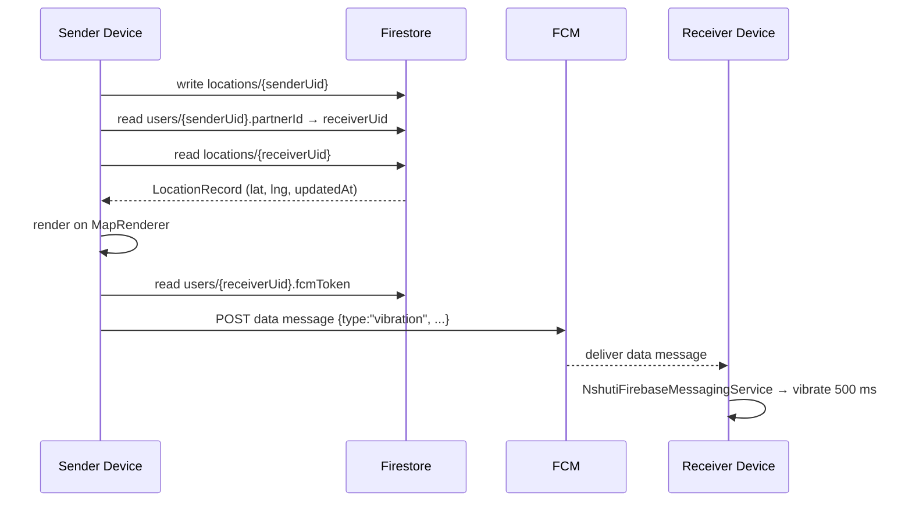
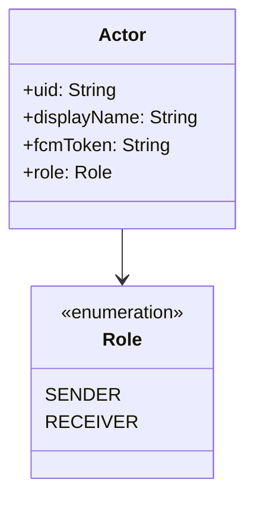

# Design Document: location-vibration-connect

## Overview

The `location-vibration-connect` feature adds a "Find & Vibrate" entry to the bottom navigation bar of NshutiPlanner. When the Sender taps it, the app:

1. Publishes the Sender's current GPS coordinates to Firestore (`locations/{senderUid}`).
2. Reads the Receiver's last known location from Firestore (`locations/{receiverUid}`), resolving the Receiver via the existing `partnerId` field on the `User` document (no email prompt needed).
3. Renders the Receiver's position on a 3D/AR map (ARCore Sceneform if supported, Google Maps 3D tilt otherwise).
4. Dispatches an FCM data message to the Receiver's device, which triggers a 500 ms haptic pulse via `NshutiFirebaseMessagingService`.

The feature is entirely self-contained: new files are added under `location/` sub-packages and the only changes to existing files are adding the new route to `Navigation.kt`, wiring the composable in `MainActivity.kt`, and extending `NshutiFirebaseMessagingService` to handle the `"vibration"` message type.

---

## Architecture

The feature follows the same layered architecture already used in the app:

```
UI Layer          LocationScreen (Compose)
                  ↕ state / events
ViewModel Layer   LocationViewModel (AndroidViewModel)
                  ↕ suspend funs / Flows
Data Layer        LocationRepository
                  ↕ Firestore SDK + FCM HTTP v1 API
Remote            Firestore  /  FCM
```

### Data flow — "Find & Vibrate" tap



### Actor model



---

## Components and Interfaces

### 1. `LocationRecord` (data model)

```kotlin
data class LocationRecord(
    val uid: String = "",
    val latitude: Double = 0.0,
    val longitude: Double = 0.0,
    val accuracyMetres: Float = 0f,
    val updatedAt: Timestamp = Timestamp.now()
)
```

Stored at Firestore path `locations/{uid}`. Each write is a `set()` (overwrite), never an `add()`.

### 2. `Actor` (domain model)

```kotlin
enum class Role { SENDER, RECEIVER }

data class Actor(
    val uid: String,
    val displayName: String,
    val fcmToken: String,
    val role: Role
)
```

Built inside `LocationViewModel.init()` from the authenticated user (`SENDER`) and their partner document (`RECEIVER`).

### 3. `LocationRepository`

New file: `data/repository/LocationRepository.kt`

Key methods:

| Method | Description |
|---|---|
| `suspend fun publishSenderLocation(actor: Actor, location: LocationRecord)` | Writes `locations/{actor.uid}` — only valid for `Role.SENDER` |
| `suspend fun fetchReceiverLocation(actor: Actor): LocationRecord` | Reads `locations/{actor.uid}` — only valid for `Role.RECEIVER` |
| `suspend fun dispatchVibrationSignal(sender: Actor, receiver: Actor)` | Sends FCM data message to `receiver.fcmToken` — only valid for `Role.RECEIVER` target |
| `suspend fun resolveActors(currentUser: User): Pair<Actor, Actor>` | Reads partner document from Firestore using `currentUser.partnerId`; returns `(senderActor, receiverActor)` |

### 4. `LocationViewModel`

New file: `viewmodel/LocationViewModel.kt`

Sealed UI state:

```kotlin
sealed class LocationUiState {
    object Idle : LocationUiState()
    object Loading : LocationUiState()
    data class Success(val receiverLocation: LocationRecord, val isStale: Boolean) : LocationUiState()
    data class Error(val message: String, val kind: ErrorKind) : LocationUiState()
}

enum class ErrorKind {
    PERMISSION_DENIED,
    RECEIVER_LOCATION_UNAVAILABLE,
    VIBRATION_UNAVAILABLE,
    SELF_TARGET,
    WRITE_FAILED,
    FCM_FAILED,
    MAP_INIT_FAILED
}
```

Primary action:

```kotlin
fun findAndVibrate()   // called on button tap; transitions Idle → Loading → Success | Error
```

### 5. `LocationScreen`

New file: `ui/screens/location/LocationScreen.kt`

Responsibilities:
- Requests `ACCESS_FINE_LOCATION` / `ACCESS_COARSE_LOCATION` via `rememberPermissionState` (Accompanist or Compose Permissions).
- Observes `LocationViewModel.uiState`.
- Renders `MapRenderer` composable when state is `Success`.
- Shows loading spinner, error card with Retry button, or staleness warning as appropriate.
- Disables "Find & Vibrate" button while `uiState is Loading`.

### 6. `MapRenderer`

New file: `ui/screens/location/MapRenderer.kt`

```kotlin
enum class RenderMode { AR, MAP_3D, MAP_2D_FALLBACK }
```

Selection logic (pure function, easily testable):

```kotlin
fun selectRenderMode(isArCoreSupported: Boolean, isMapInitOk: Boolean): RenderMode
```

- `isArCoreSupported = true` → `AR`
- `isArCoreSupported = false` → `MAP_3D`
- `isMapInitOk = false` → `MAP_2D_FALLBACK`

### 7. `NshutiFirebaseMessagingService` (extended)

Existing file extended to handle `type = "vibration"` data messages:

```kotlin
override fun onMessageReceived(message: RemoteMessage) {
    if (message.data["type"] == "vibration") {
        triggerHapticPulse()   // 500 ms via Vibrator / VibrationEffect
    } else {
        // existing notification path
    }
}

override fun onNewToken(token: String) {
    // write token to users/{uid}.fcmToken in Firestore
}
```

### 8. Navigation additions

`Navigation.kt` — add:
```kotlin
object LocationVibrate : Route("location_vibrate")
```

`bottomNavItems` — add:
```kotlin
BottomNavItem(Route.LocationVibrate.route, "Find & Vibrate", Icons.Filled.LocationOn)
```

`MainActivity.kt` — add composable block for `Route.LocationVibrate.route`.

---

## Data Models

### Firestore schema additions

| Collection | Document | Fields added |
|---|---|---|
| `locations` | `{uid}` | `uid`, `latitude`, `longitude`, `accuracyMetres`, `updatedAt` |
| `users` | `{uid}` | `fcmToken` (String) — added by `onNewToken` |

The `User` data class already has `partnerId` and `coupleId`; no schema change needed there.

### FCM VibrationSignal payload

```json
{
  "message": {
    "token": "<receiver_fcm_token>",
    "data": {
      "type": "vibration",
      "senderUid": "<senderUid>",
      "senderName": "<displayName>"
    }
  }
}
```

Sent via FCM HTTP v1 API (`https://fcm.googleapis.com/v1/projects/{projectId}/messages:send`) using a server-side OAuth2 token obtained from the service account credentials bundled in `google-services.json`. The call is made from `LocationRepository` on the client using the Firebase Admin SDK approach or a direct HTTP call with the app's identity token.

> Design decision: Since this is a mobile-only app without a dedicated backend, the FCM dispatch is performed client-side using the Firebase Auth ID token to call the FCM HTTP v1 endpoint directly. This avoids needing a Cloud Function for the MVP. The trade-off is that the sender's FCM server key is not exposed (HTTP v1 uses OAuth2 scoped tokens, not the legacy server key).

### Staleness threshold

A `LocationRecord` is considered stale when:
```
(System.currentTimeMillis() - updatedAt.toDate().time) > 30 * 60 * 1000
```

This is computed in `LocationViewModel` and surfaced as `Success(isStale = true)`.

---

## Correctness Properties

*A property is a characteristic or behavior that should hold true across all valid executions of a system — essentially, a formal statement about what the system should do. Properties serve as the bridge between human-readable specifications and machine-verifiable correctness guarantees.*

### Property 1: LocationRecord write completeness

*For any* valid GPS coordinate (latitude, longitude, accuracy), when `publishSenderLocation` is called with a `SENDER` actor, the document written to `locations/{senderUid}` must contain all five required fields (`uid`, `latitude`, `longitude`, `accuracyMetres`, `updatedAt`) with values matching the input.

**Validates: Requirements 3.1, 3.2**

---

### Property 2: LocationRecord overwrite idempotence

*For any* two sequential calls to `publishSenderLocation` with different coordinates, only the second (latest) `LocationRecord` should be present at `locations/{senderUid}` — the document count must remain exactly 1.

**Validates: Requirements 3.4**

---

### Property 3: Location fetch round-trip

*For any* `LocationRecord` written to `locations/{receiverUid}`, calling `fetchReceiverLocation` with a `RECEIVER` actor for that uid must return a record with the same `latitude` and `longitude`, and the `LocationViewModel` must expose those values in its `Success` state.

**Validates: Requirements 4.2, 4.5**

---

### Property 4: Staleness detection

*For any* `LocationRecord` whose `updatedAt` timestamp is more than 30 minutes in the past, the `LocationViewModel` must produce a `Success` state with `isStale = true`; for any record updated within the last 30 minutes, `isStale` must be `false`.

**Validates: Requirements 4.4**

---

### Property 5: VibrationSignal payload correctness

*For any* sender/receiver `Actor` pair, the FCM data message dispatched by `dispatchVibrationSignal` must contain exactly the fields `type = "vibration"`, `senderUid = sender.uid`, and `senderName = sender.displayName`.

**Validates: Requirements 6.2**

---

### Property 6: Role-based write guard

*For any* `Actor` with `role = Role.RECEIVER`, calling `publishSenderLocation` must throw an `IllegalArgumentException` (or equivalent) and must not write any document to Firestore.

**Validates: Requirements 8.2**

---

### Property 7: Role-based read guard

*For any* `Actor` with `role = Role.SENDER`, calling `fetchReceiverLocation` must throw an `IllegalArgumentException` and must not read any document from Firestore.

**Validates: Requirements 8.3**

---

### Property 8: Role-based dispatch guard

*For any* `Actor` with `role = Role.SENDER` passed as the `receiver` argument to `dispatchVibrationSignal`, the function must throw an `IllegalArgumentException` and must not make any FCM call.

**Validates: Requirements 8.4**

---

### Property 9: Loading state disables action

*For any* `LocationUiState.Loading` state, the "Find & Vibrate" button must be disabled (i.e., `enabled = false` in the Compose UI), and the loading indicator must be visible.

**Validates: Requirements 9.1, 9.4**

---

## Error Handling

| Scenario | ViewModel state emitted | UI response |
|---|---|---|
| Location permission denied | `Error(kind = PERMISSION_DENIED)` | Explanatory message + "Open Settings" button |
| GPS timeout, no last-known location | `Error(kind = WRITE_FAILED)` | Error card + Retry |
| Firestore write fails | `Error(kind = WRITE_FAILED)` | Error card + Retry |
| Receiver has no LocationRecord | `Error(kind = RECEIVER_LOCATION_UNAVAILABLE)` | Error card + Retry |
| Receiver FCM token absent/empty | `Error(kind = VIBRATION_UNAVAILABLE)` | Error card (no Retry for FCM — user must ask partner to reopen app) |
| FCM dispatch fails | `Error(kind = FCM_FAILED)` | Error card + Retry |
| Sender == Receiver (same uid) | `Error(kind = SELF_TARGET)` | Error card, no Retry |
| MapRenderer init fails | `Error(kind = MAP_INIT_FAILED)` | Falls back to `MAP_2D_FALLBACK` mode silently |

All error messages are human-readable strings stored in string resources (`strings.xml`), not raw exception messages.

---

## Testing Strategy

### Unit tests (JUnit 4 / MockK)

Focus on specific examples, edge cases, and error conditions:

- `LocationRecord` field validation (all five fields present, correct types).
- `selectRenderMode()` — example tests for each of the three outcomes.
- `LocationViewModel` state transitions: Idle → Loading → Success, Idle → Loading → Error for each `ErrorKind`.
- `NshutiFirebaseMessagingService.onMessageReceived` — example: data message with `type = "vibration"` calls vibrator; notification message does not.
- `NshutiFirebaseMessagingService.onNewToken` — example: token is written to correct Firestore path.
- Edge cases: GPS timeout fallback, empty FCM token guard, self-target guard, stale location boundary (exactly 30 min).

### Property-based tests (kotest `PropTestConfig` with `forAll`)

Property-based testing library: **Kotest** (`io.kotest:kotest-property`) — already compatible with the project's Kotlin/JUnit setup.

Each property test runs a minimum of **100 iterations**.

Each test is tagged with a comment in the format:
`// Feature: location-vibration-connect, Property <N>: <property_text>`

| Property | Test description |
|---|---|
| Property 1 | Generate random lat/lng/accuracy; assert written document has all 5 fields matching input |
| Property 2 | Generate two random coordinates; write both sequentially; assert only one document exists with the second coordinate |
| Property 3 | Generate random LocationRecord; write then fetch; assert returned lat/lng equals written values |
| Property 4 | Generate random timestamps (some > 30 min ago, some ≤ 30 min ago); assert `isStale` matches the threshold predicate |
| Property 5 | Generate random sender/receiver Actor pairs; assert dispatched FCM payload fields match actor fields |
| Property 6 | Generate random RECEIVER actors; assert `publishSenderLocation` throws and no Firestore write occurs |
| Property 7 | Generate random SENDER actors; assert `fetchReceiverLocation` throws and no Firestore read occurs |
| Property 8 | Generate random SENDER actors as receiver arg; assert `dispatchVibrationSignal` throws and no FCM call occurs |
| Property 9 | For any Loading state, assert button `enabled = false` and loading indicator `isVisible = true` |

### Integration / instrumented tests

- End-to-end: tap "Find & Vibrate" on a device with a real Firestore emulator; assert `locations/{uid}` document is created and the ViewModel reaches `Success` state.
- FCM delivery is tested manually (emulator → physical device) due to platform constraints.
